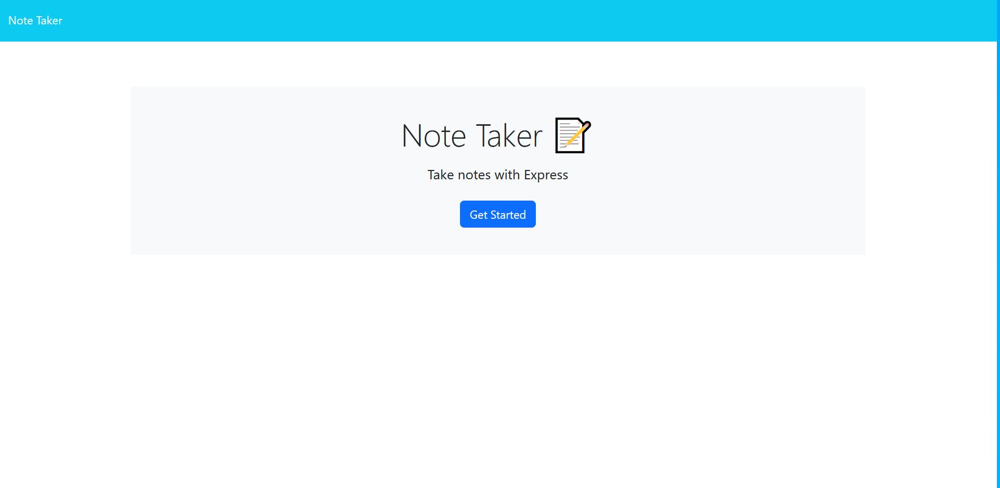
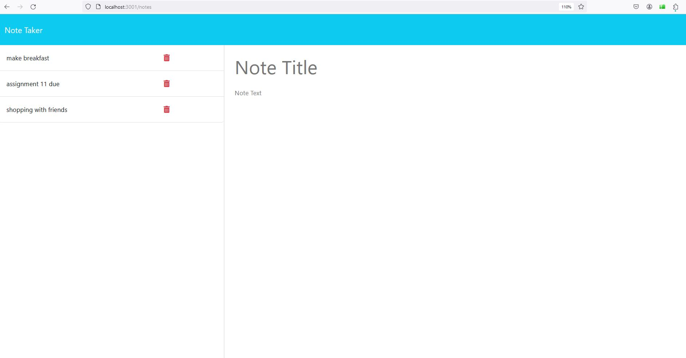

# 11 Express.js: Note Taker

## Purpose

This note-taking application uses an Express.js back end and saves and retrieves note data from a JSON file.

In the future, this project may be refactored for improved efficiency and readability.

## User Story

```
AS A small business owner
I WANT to be able to write and save notes
SO THAT I can organize my thoughts and keep track of tasks I need to complete
```

## Acceptance Criteria

```
GIVEN a note-taking application
WHEN I open the Note Taker
THEN I am presented with a landing page with a link to a notes page
WHEN I click on the link to the notes page
THEN I am presented with a page with existing notes listed in the left-hand column, plus empty fields to enter a new note title and the note’s text in the right-hand column
WHEN I enter a new note title and the note’s text
THEN a "Save Note" button and a "Clear Form" button appear in the navigation at the top of the page
WHEN I click on the Save button
THEN the new note I have entered is saved and appears in the left-hand column with the other existing notes and the buttons in the navigation disappear
WHEN I click on an existing note in the list in the left-hand column
THEN that note appears in the right-hand column and a "New Note" button appears in the navigation
WHEN I click on the "New Note" button in the navigation at the top of the page
THEN I am presented with empty fields to enter a new note title and the note’s text in the right-hand column and the button disappears
```

# Built With
* JavaScript
* HTML
* CSS
* Express.js
* npm uuid package

# Usage
Access the website below. When opened, the user is presented with a landing page with a link that opens the notes page that shows existing notes listed in the left-hand column, and empty fields to enter a new note title and the note's text in the right-hand column. When the save icon in the top navigation bar is clicked, the newly entered note is saved and appears in the left-hand column with other existing notes.

When clicking on an existing note in the list in the left-hand column, that note appears in the right-hand column. When clicking on the Write icon in the top navigation bar, the user is presented with empty fields to enter a new note title and the note's text in the right-hand column.


# Screenshots






* In order to run the application, click on the [Khoi Phan Note Taker](https://express-notetaker-dlyc.onrender.com//)
The following animation demonstrates the application functionality:

# Credits
Created by Khoi Phan.


## License
[](https://opensource.org/licenses/MIT)

SVG Logo Maker © is licensed under the MIT license.  

For more information regarding the SVG Logo Maker's license, please visit: 
https://opensource.org/licenses/MIT

  
## Questions?
  
### Github:[khoiphan-9194](https://github.com/khoiphan-9194)
  
### Reach Me Via Email: phanminhkhoi91@gmail.com
